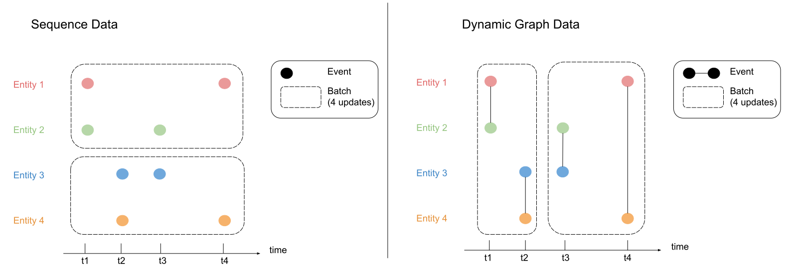
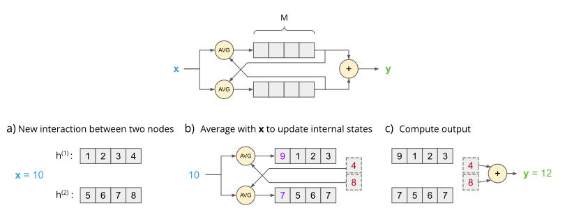

# Mind the truncation gap: challenges of learning on dynamic graphs

Official code for the paper [Mind the truncation gap: challenges of learning on dynamic graphs with recurrent architectures](https://openreview.net/forum?id=QezxDgd5hf).



Includes our toy task implementation, together with the python scripts required to train and evaluate a GRNN model on this task using both full backpropagation and truncated backpropagation.

Also includes python scripts to reproduce the experiments on public dynamic graph datasets, comparing full and truncated backpropagation.

# Using the synthetic task

Our proposed synthetic link regression task can be used as a simple benchmark to test an algorithm's ability to learn longer term dependencies.



The following example instantiates the synthetic task with 100 nodes and a memory of 3 steps and uses it to generate edges:

```python
import jax
from jax import lax
from tgap.data.buffer_task import get_sampler_link_regression

init_data, step_data = get_sampler_link_regression(num_nodes=100, delay=3)

# initialize state
rng = jax.random.PRNGKey(123)
initial_data_state = init_data(rng)

# run 1 step
new_data_state, (edge_src, edge_dst, edge_feat, edge_target) = step_data(initial_data_state)

# run 1000 steps
new_data_state, (edges_src, edges_dst, edges_feat, edges_target) = lax.scan(step_data, initial_data_state, None, 1000)
```

# Running the Synthetic Task Experiments

Install dependencies (with python >= 3.9):

```{bash}
pip install -r requirements.txt
```

Run full or truncated backprop:

```{bash}
# Full Backprop
python run_toy_task.py --method FBPTT

# Truncated Backprop
python run_toy_task.py --method TBPTT
```
